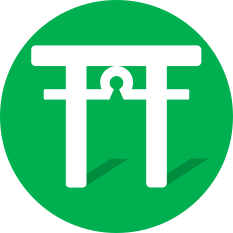
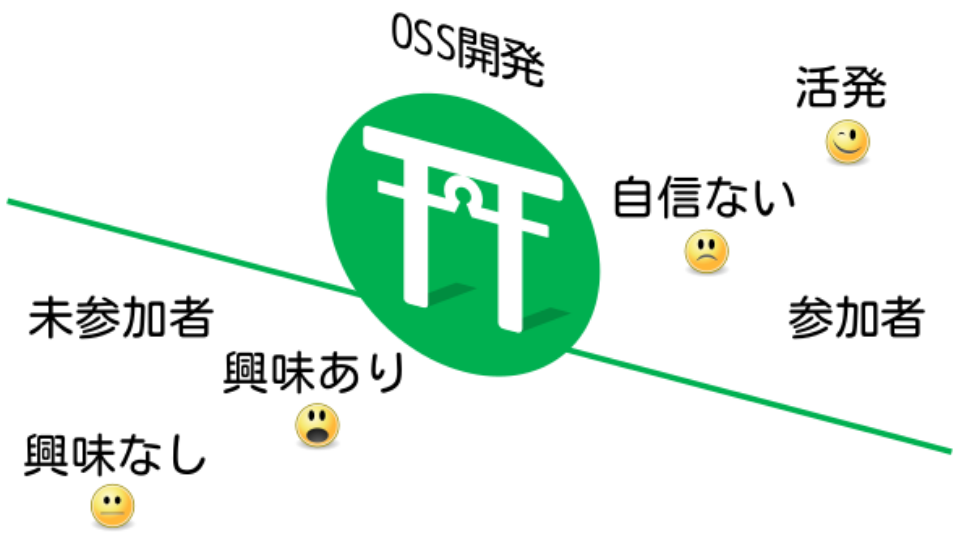
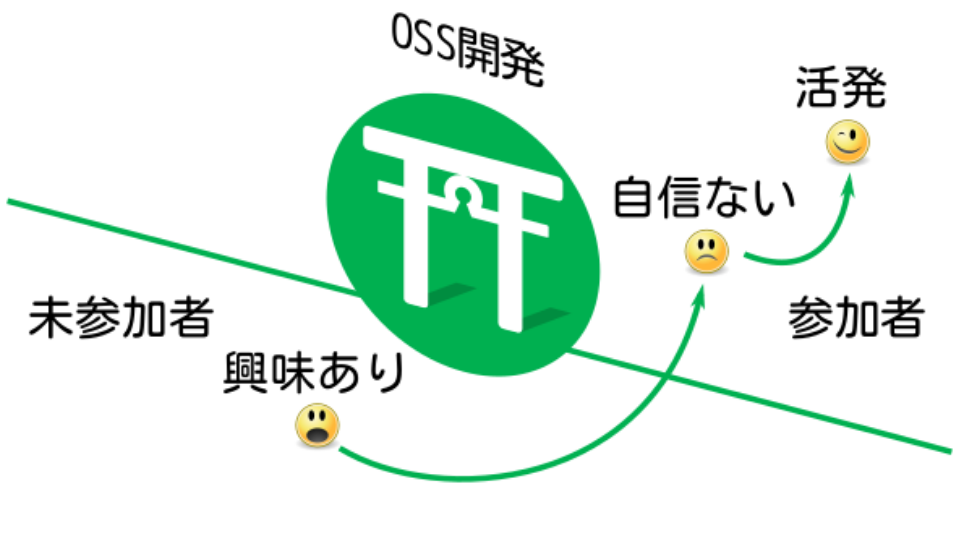
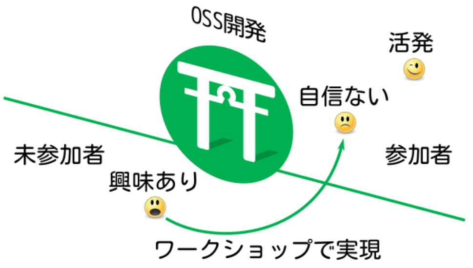
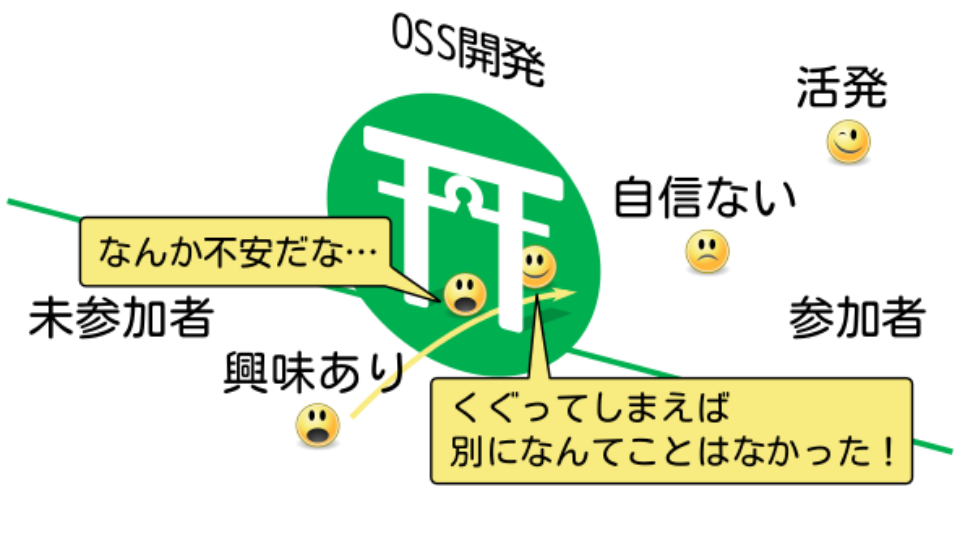
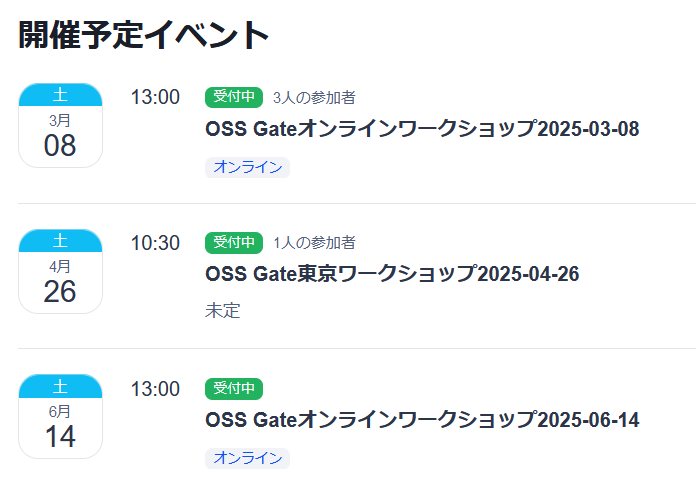
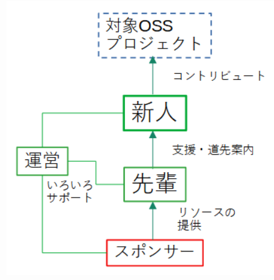
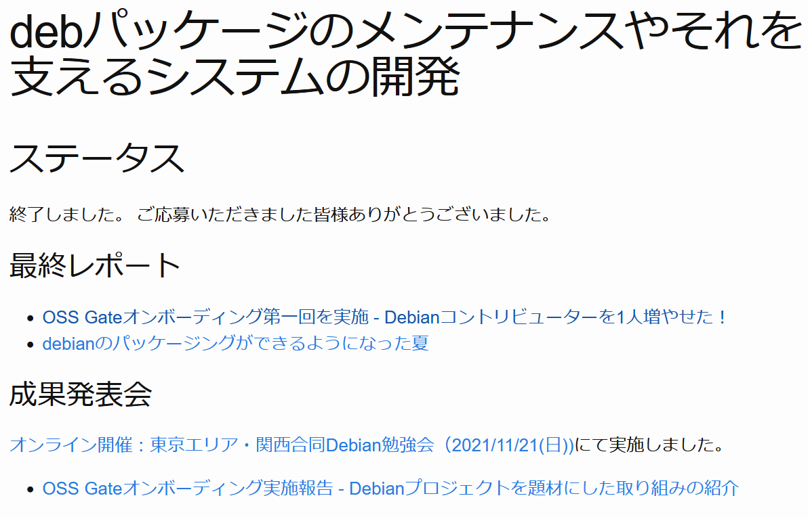

# OSS開発の入り口\\n「OSS Gate」の歩み

subtitle
: OSS開発を体験してみませんか？

author
: 福田大司郎

institution
: 株式会社クリアコード

content-source
: BuriKaigi 2025

date
: 2025-02-01

allotted-time
: 5m

theme
: clear-code

# About me

# 株式会社クリアコード

{:relative-width="90"}

{:.center}

**自由ソフトウェア**と**ビジネス**を両立！

# 自由な世界

# 自由ソフトウェア\\n(オープンソース)

# OSS開発の魅力

* 様々なソフトウェアと関われる
* 世界中のエンジニアと関われる
* 自分の貢献が自分の成果として残る
* 実は身近な存在

# OSS Gate

{:relative-width="25"}

{:.center}
OSSの門？

{:.center}
{::note}<https://github.com/oss-gate/workshop/tree/master/tutorial>{:/note}

# 門 = 境界

{:.center}
{::note}<https://github.com/oss-gate/workshop/tree/master/tutorial>{:/note}

# やりたいこと

{:.center}
{::note}<https://github.com/oss-gate/workshop/tree/master/tutorial>{:/note}

# OSS開発参加者を\\n継続的に増やす

# OSS Gateワークショップ

# OSS Gateワークショップ

* 「増やす」を実現するための1手段
* **未**経験者が経験者になると増える

# ワークショップの重要事項

{:.center}
{:.x-large}

体験する

{:.center}
{::note}体験して大したことはないとわかる→敷居が下がる{:/note}

# 体験して門をくぐる

{:relative-width="70"}

{:.center}
{::note}<https://github.com/oss-gate/workshop/tree/master/tutorial>{:/note}

# よりくぐりやすく

{:relative-width="70"}

{:.center}
{::note}<https://github.com/oss-gate/workshop/tree/master/tutorial>{:/note}

# 流れ

1. **ユーザーとして**OSSを動かす
2. ↑で気づいた事を開発元に**フィードバック**

# 期待

* 普段は気づいていないだけで
  実はフィードバックポイントが
  あったことを**体験**して！
  * ※普段、ググってブログなどで回避策を探していませんか？
* フィードバックを**体験**して！

# 定期的に開催してます

{:relative-height="85"}

{:.center}
{::note}<https://oss-gate.doorkeeper.jp/events/upcoming>{:/note}

# 誰でも\\n開催できる

# コロナ以降\\nオンライン

# オフライン開催復活！

# 東京ワークショップ

# 東京以外でも

# 有志の方が各地で開催！

* PHP Lovers Meetup vol.3 + OSS Gate in 北の大地
  * 2024/01/14 札幌
* PHP Lovers Meetup vol.4 + OSS Gate in 関西
  * 2024/02/12 大阪

# 企業様とコラボ

# フィヨルドブートキャンプ様とコラボ開催

詳しくは次のブログを！

* オンラインプログラミングスクールのフィヨルドブートキャンプとOSS Gateのコラボレーション企画開催！！
  * {::note}<https://bootcamp.fjord.jp/articles/80>{:/note}
* フィヨルドブートキャンプ様とOSS Gateワークショップをコラボ実施しました！
  * {::note}<https://www.clear-code.com/blog/2024/2/2/ossgate-workshop-with-fjord-boot-camp.html>{:/note}

# OSS Gateオンボーディング

{:relative-height="85"}

{:.center}
{::note}<https://oss-gate.github.io/on-boarding/about/>{:/note}

# オンボーディング事例

{:relative-height="75"}

{:.center}
{::note}<https://oss-gate.github.io/on-boarding/proposals/2021-08/kenhys-maintain-debian-packages/>{:/note}

# OSS Gateを活用して！

* ワークショップ参加/開催
* 会場提供
* コラボレーション・アレンジ開催

# 活用事例

* 自分の世界を広める
* 社員研修
* 御社専用のアレンジ開催
* 宣伝・人材発掘

# ご参加お待ちしてます

* 公式ウェブサイト
  * {::note}<https://oss-gate.github.io/>{:/note}
* コミュニティーチャット
  * {::note}<https://oss-gate.github.io/>{:/note}
* 直近のワークショップ開催予定
  * {::note}<https://oss-gate.doorkeeper.jp/events/upcoming>{:/note}
* みなさまの感想・ブログ
  * {::note}<https://oss-gate.github.io/workshop/report.html>{:/note}
